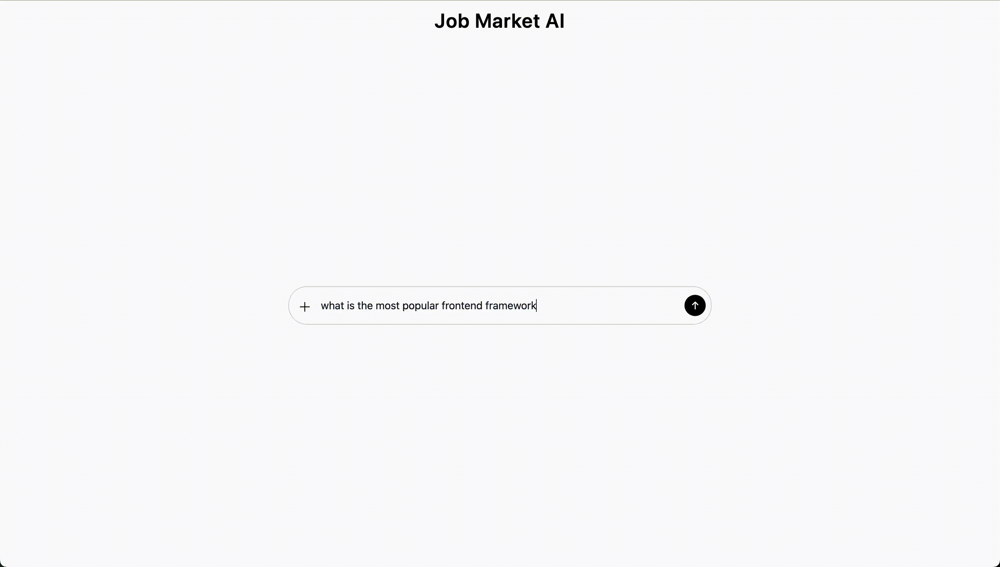
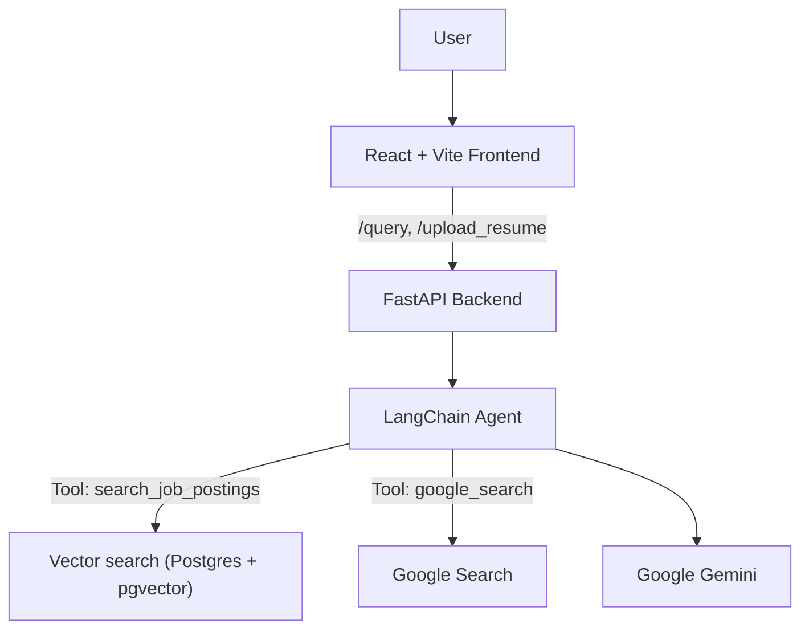

# Job Market AI - Backend

The backend of an AI agent that answers tech job market questions using RAG on job postings

> **Demo:**
> See the animation below for a demonstration of the Job Market AI.

## Features

- **Tech job market Q&A**: Ask about popular frameworks and tech stacks
- **Web search**: A custom Google search tool for the agent to answer questions about recent tech news
- **Resume-driven skill recommendations**: Upload a resume; get 1-3 high-impact technical skills that synergize with your background

## Architecture

## How It Works

- When user asks a question:
  - The /query endpoint of the backend is reached, and the agent is executed
  - The agent has two tools:
    - `search_job_postings`: uses RAG over the vector database to retrieval relevant documents, and uses an LLM call to generate response
    - `google_search`: searches Google and uses an LLM call to generate response
  - The agent will decide which tool is appropriate to use
- When user uploads a resume:
  - The /upload_resume endpoint is reached
  - The resume is parsed, key skills are extracted from the resume, a database query is executed to fetch similar documents, and the LLM is invoked to generate response

## Implementation

**Vector search**:
- An ensemble of dense vector search + BM25 keyword search retriever is used with weights 0.5-0.5 to balance semantic meaning and keyword matches
- A multi-query retrieval strategy is used via an LLM call to expand the breadth of the retrieved results, avoiding a narrow result set

## Design

- The database connection, BM25 retriever, and embedding model are cached to reduce per-request overhead
- Custom Exceptions for robust error handling
- Highly modularized code for scalability

## Tech Stack

- **Backend**: FastAPI, Pydantic
- **Agent/LLM**: Langchain, Google Gemini, Gemini Embedding Model
- **Database**: Postgres + PGVector
- **Container**: Docker

## See also

- Frontend (GitHub): https://github.com/TomZhang11/Job-Market-AI-Frontend
