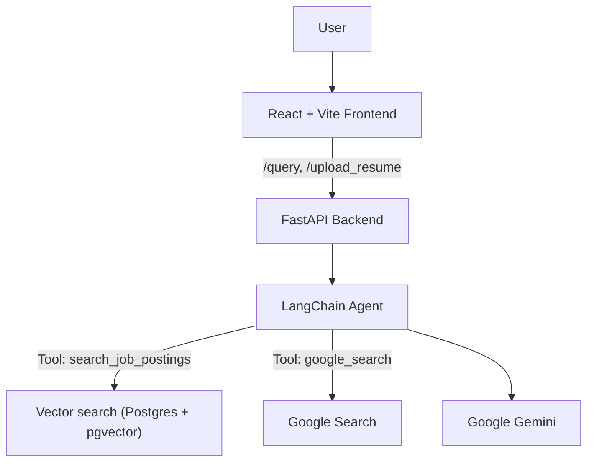

# Job Market AI - Backend

The backend of an AI agent that answers tech job market questions using RAG on job postings

> **Demo:**
> See the animation below for a demonstration of the Job Market AI.


## Features
- **Tech job market Q&A**: Ask about popular frameworks and tech stacks
- **Web search**: A custom Google search tool for the agent to answer questions about recent tech news
- **Resume-driven skill recommendations**: Upload a resume; get 1-3 high-impact technical skills that synergize with your background

## Architecture




## implementation
- **Hybrid retrieval**: Ensemble of dense vector search and BM25 keyword search, with multi-query expansion via LLM.
- It uses a hybrid (dense + BM25) search with multi-query retrieval over a PGVector database of job postings
- A custom Google search tool for recent news
## design
## workflow of the program

## Tech Stack

- **Backend**: FastAPI, Pydantic
- **LLM**: Gemini via `langchain-google-genai`
- **Retrieval**: `langchain-postgres` (PGVector), `BM25Retriever`, `EnsembleRetriever`, `MultiQueryRetriever`
- **Search**: Google Custom Search via `langchain_google_community.GoogleSearchAPIWrapper`


## Bootstrap the Vector Database

1. Place your PDFs into subfolders under `data/`:
   - `data/AI/`
   - `data/Full stack/`
   - `data/Software/`
2. From the project root, run:

```
pip install -r backend/requirements.txt
python scripts/setup_vectordb.py
```

This script:

- Loads PDFs and splits them into overlapping chunks.
- Creates embeddings via Gemini (`models/embedding-001`).
- Writes chunks and vectors into the `job_chunks` collection in PGVector.


## How It Works

- The agent (`backend/agent.py`) has two tools:
  - `search_job_postings`: Hybrid retrieval over PGVector using an ensemble of dense + BM25, expanded by an LLM via `MultiQueryRetriever`.
  - `google_search`: Google Custom Search for recent news. If the Web Search toggle is on, this tool is used exclusively.
- For resume flow, the app:
  1. Extracts text from the PDF and filters for skills via LLM.
  2. Queries related postings (weighted ensemble) to provide evidence.
  3. Generates 1-3 skill recommendations with rationale.

## Development Notes

- The BM25 retriever and DB connections are cached to reduce per-request overhead.

## See also

- Frontend (GitHub): https://github.com/TomZhang11/Job-Market-AI-Frontend
